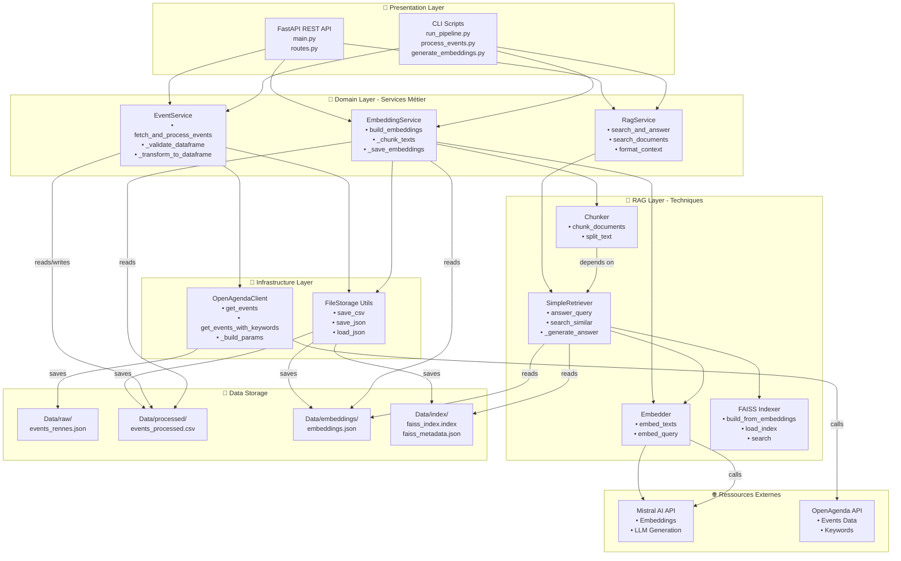
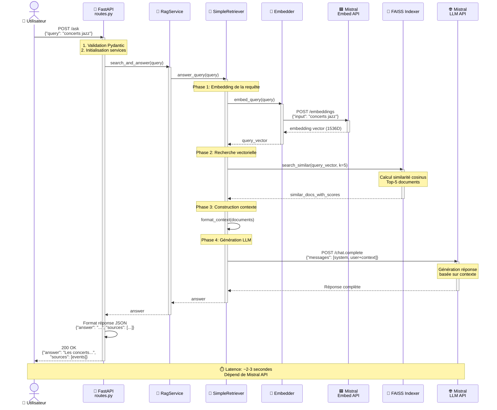

# 📘 PULS_EVENTS - Mix'n'Renn

**Assistant intelligent de recommandation d'événements culturels de Rennes Métropole**

[](https://www.python.org/)
[](https://fastapi.tiangolo.com/)
[](https://python.langchain.com/)
[](https://mistral.ai/)

## 🎯 Objectif du projet

Système RAG (Retrieval-Augmented Generation) complet pour recommander des événements musicaux de Rennes Métropole en temps réel, utilisant :
- 🌐 **API OpenAgenda** pour les données d'événements
- 🧠 **Mistral AI** pour embeddings et génération de réponses
- 📊 **FAISS** pour l'indexation vectorielle
- ⚡ **FastAPI** pour l'API REST
- 🔗 **LangChain** pour l'orchestration RAG

## ✨ Fonctionnalités

- ✅ **Recherche intelligente** d'événements musicaux par requête naturelle
- ✅ **API REST complète** avec documentation interactive (Swagger)
- ✅ **Scripts CLI** pour automatisation (pipeline complet ou étapes individuelles)
- ✅ **Mise à jour dynamique** des données via endpoints
- ✅ **Évaluation RAG** avec métriques Ragas
- ✅ **Gestion robuste** des erreurs et validation des données
- ✅ **Architecture en couches** professionnelle et évolutive
- ✅ **Services métier réutilisables** (Dependency Inversion Principle)

---


## 📊 Diagrammes Architecturaux

### 🏗️ Diagramme de Composants - Architecture UML



### 🔄 Diagramme de Séquence - Requête de Recherche (POST /ask)



### Structure des Fichiers

```
PULS_EVENTS/
│
├── 📚 Documentation
│   ├── README.md                          # Ce fichier
│   └── Documents/
│       ├── COMPONENT_DIAGRAM.md           # Diagramme de composants UML
│       ├── SEQUENCE_DIAGRAM.md            # Diagramme de séquence
│       └── instructions.md                # Instructions du projet
│
├── ⚙️ Configuration
│   ├── config/
│   │   ├── config.py          # Configuration centralisée
│   │   └── logger.py          # Logger configuré
│   ├── .env                   # Variables d'environnement (non versionné)
│   ├── .gitignore
│   ├── requirements.txt
│   └── pyproject.toml
│
├── 🚀 Application
│   └── src/
│       ├── presentation/      # 🎨 Interfaces utilisateur
│       │   ├── api/          # API REST (FastAPI)
│       │   │   ├── main.py
│       │   │   └── routes.py
│       │   └── cli/          # Scripts en ligne de commande
│       │       ├── process_events.py
│       │       ├── generate_embeddings.py
│       │       ├── build_index.py
│       │       └── run_pipeline.py
│       │
│       ├── domain/           # 🧠 Logique métier (cœur)
│       │   ├── models/       # Modèles de données
│       │   └── services/     # Services métier réutilisables
│       │       ├── event_service.py
│       │       ├── embedding_service.py
│       │       ├── evaluation_service.py
│       │       └── rag_service.py
│       │
│       ├── infrastructure/   # 🔌 Accès externe
│       │   └── openagenda_client.py
│       │
│       ├── rag/             # 🤖 Composants RAG techniques
│       │   ├── embedder.py
│       │   ├── chunker.py
│       │   ├── retriever.py
│       │   └── langchain_faiss_indexer.py
│       │
│       ├── evaluation/      # 📊 Évaluation RAG
│       │   ├── build_testset.py
│       │   ├── evaluate_rag.py
│       │   ├── test_questions.json
│       │   └── testset.json
│       │
│       └── utils/           # 🛠️ Utilitaires
│
├── 📊 Données
│   └── Data/
│       ├── raw/             # Données brutes JSON
│       ├── processed/       # Données traitées CSV
│       ├── embeddings/      # Vecteurs d'embeddings
│       ├── index/           # Index FAISS
│       └── documents/       # Documents traités
│
├── 📓 Notebooks
│   └── 01_EDA_JSON_RENNES.ipynb  # Analyse exploratoire des données
│
└── 🧪 Tests
    └── tests/
        ├── test_api.py
        ├── test_chunker.py
        ├── test_cli_scripts.py
        ├── test_embedder.py
        ├── test_embedding_service.py
        ├── test_embedding_service_extended.py
        ├── test_evaluation.py
        ├── test_event_service.py
        ├── test_event_service_extended.py
        ├── test_integration_imports.py
        ├── test_openagenda_client.py
        ├── test_openagenda_extended.py
        ├── test_rag_service.py
        ├── test_retriever_simple.py
        └── test_routes_complete.py
```

---

## 🚀 Installation Rapide

### Prérequis
- Python 3.13+
- pip
- Git

### 1️⃣ Cloner et setup

```bash
# Cloner le dépôt
git clone https://github.com/RandomFab/PULS_EVENTS.git
cd PULS_EVENTS

# Créer l'environnement virtuel
python -m venv .venv

# Activer l'environnement
.venv\Scripts\activate  # Windows
source .venv/bin/activate  # Linux/Mac

# Installer les dépendances
pip install -r requirements.txt
```

### 2️⃣ Configuration

Créez un fichier `.env` à la racine :

```env
# Clés API (obligatoires)
MISTRAL_API_KEY=votre_cle_mistral
OPENAGENDA_API_KEY=votre_cle_openagenda
```

### 3️⃣ Initialiser les données

**Option A : Pipeline complet automatique** (recommandé)
```bash
# Exécute toutes les étapes : récupération → embeddings → index
python -m src.presentation.cli.run_pipeline

# Avec dates personnalisées
python -m src.presentation.cli.run_pipeline --start-date 01/06/25 --end-date 31/12/25
```

**Option B : Scripts individuels**
```bash
# 1. Récupérer les événements OpenAgenda
python -m src.presentation.cli.process_events

# 2. Générer les embeddings
python -m src.presentation.cli.generate_embeddings

# 3. Construire l'index FAISS
python -m src.presentation.cli.build_index
```

### 4️⃣ Lancer l'API

```bash
# Mode développement
uvicorn src.presentation.api.main:app --reload

# Mode production
uvicorn src.presentation.api.main:app --host 0.0.0.0 --port 8000
```

### 🐳 Alternative : Utilisation avec Docker Compose

Si vous préférez utiliser Docker, assurez-vous d'avoir Docker et Docker Compose installés.

#### Construire l'image et créer le container
```bash
docker-compose up --build
```

#### Lancer le container (si déjà construit)
```bash
docker-compose up
```

🎉 **L'API est prête !**
- 📖 SWAGGER : http://localhost:8000/docs

---

## 📡 Utilisation de l'API

### Endpoints Principaux

#### 💬 Poser une question
```bash
POST /ask
{
  "query": "Quels sont les concerts rock ce weekend ?"
}
```

#### 🔍 Recherche brute
```bash
POST /search_raw
{
  "query": "jazz"
}
```

#### 🔄 Mettre à jour les données
```bash
POST /update_datas
{
  "start_date": "01/01/25",
  "end_date": "31/12/25"
}
```

#### 🏗️ Reconstruire l'index
```bash
POST /rebuild
```

#### 📊 Évaluer le RAG
```bash
GET /evaluate_rag
```

---

## 🧪 Tests

```bash
# Tous les tests
pytest

# Tests spécifiques
pytest tests/test_api.py

# Avec couverture
pytest --cov=src
```

---

## 🔒 Sécurité

⚠️ **Ne jamais commiter le fichier `.env`**  
Les clés API doivent rester secrètes.

---

## 🐛 Dépannage

### "Module not found"
```bash
pip install -r requirements.txt
```

### "MISTRAL_API_KEY not found"
Vérifier que `.env` existe et contient la clé.

### "Index FAISS introuvable"
```bash
python -m src.presentation.cli.build_index
# Ou exécuter le pipeline complet
python -m src.presentation.cli.run_pipeline
```

### "ModuleNotFoundError: No module named 'src.app'"
L'ancienne architecture a été refactorisée. Utilisez les nouveaux chemins :
- ❌ `src.app.main` → ✅ `src.presentation.api.main`


---

## 👤 Auteur

**Fabien** - [RandomFab](https://github.com/RandomFab)

---

## 🙏 Remerciements

- [Mistral AI](https://mistral.ai/) pour les modèles
- [OpenAgenda](https://openagenda.com/) pour l'API
- [LangChain](https://python.langchain.com/) pour le framework
- [FastAPI](https://fastapi.tiangolo.com/) pour l'API

---

**⭐ Si ce projet vous est utile, donnez-lui une étoile !**
```
